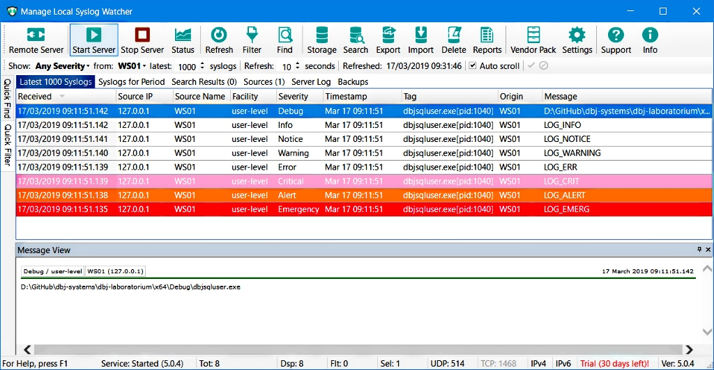

# dbjsysloglib 

Standard C implementation



For our Windows server side deliverables we use "[SysLog Watcher](https://syslogwatcher.com/)".

(For another good and mature syslog server please check: https://www.paessler.com/free_syslog_server )

The project we started from is Copyright (c) 2008 Secure Endpoints Inc.


> ## Disclaimer: <br/>
> #### This is Free Open Source code. <br/>
> #### Use at your own risk. We do.


Currently [RFC3164](https://tools.ietf.org/html/rfc3164) is followed. Plan is to develop a support for the newer one: 
[RFC5424](https://tools.ietf.org/html/rfc5424).

### Usage and the API

Before any usage syslog connection must be initialized.

```cpp
// declaration
extern void   dbj_syslog_initalize(const char*  ip_and_port  , const char* id );

'''

//usage
// syslog server is at localhost:514
// "tag" is "my tag" 
dbj_syslog_initalize( nullptr , "my tag");
```
"host" will be local machine name
"facility" will be "user"
PID aka process id will be added to the tag. Thus above tag will appear as
`my tag[pid:10848]` for example.

Loging and syslog are cool and best way to develop resilient software.
But be carefull not to introduce too much hard-wired dependancies by using the dbjsysloglib (syslog).

We recomend using the set of macros found at the botom of the `dbj++log.h`,  in order to 
decouple a bit more.

```cpp
// ERROR
#define DBJ_LOG_ERR(...) 
// CRITICAL
#define DBJ_LOG_CRT(...) 
// ALERT
#define DBJ_LOG_LRT(...) 
// WARNING
#define DBJ_LOG_WRG(...) 
// EMERGENCY
#define DBJ_LOG_MCY(...) 
// DEBUG
#define DBJ_LOG_DBG(...) 
// INFO
#define DBJ_LOG_INF(...) 
// NOTICE
#define DBJ_LOG_NTC(...)
```

Keep in mind these macros ara available only to C++ code. They are also using local inline functions that provide mutex locking to each of them.
These macros are calling C API functions declared in `dbjsyslog.h`
```cpp
/* dbjsyslog.h, C API */
extern void  syslog_emergency(const char* format_, ...);
extern void  syslog_alert(const char* format_, ...);
extern void  syslog_critical(const char* format_, ...);
extern void  syslog_error(const char* format_, ...);
extern void  syslog_warning(const char* format_, ...);
extern void  syslog_notice(const char* format_, ...);
extern void  syslog_info(const char* format_, ...);
extern void  syslog_debug(const char* format_, ...);
```
Currently implementations of these functions are not resilient in presence of threads.

Use these macros. They are active if DBJ_SYSLOGLIB is defined before 
including `dbj++log.h`, if not they are `__noop`.

<span id="features">

### What are the actual syslog features?

Please make sure you have read once the RFC's 3164 and [5424](https://tools.ietf.org/html/rfc5424) . (Links are at the top of the doc.)

The dbjsysloglib behaviour is standard, as described on  numerous pages on the web.
`syslog.h` header in here is 99% standard and you are free to browse through it to understand all the options.

#### Async behaviour and Multi Threading

This API is asynchronous as much as windows sockets are asynchronous.

This C API is not, resilient in presence of mutliple threads. Althugh the core implementation is `syslog.c` uses critical section.

The C++ API is resilient in the presence of multiple threads.

##### dbjsysloglib SysLog Messages are composed following the RFC3164

Make sure you syslog server can understand them. Which is the case with almost all of them. 
This is simply because there are milions of devices in use (and will be for a long time to come) who are emitting 
syslog messages in the RFC3164 format. Note: Devices on the network, not PC's or laptops.

> This is a static library, built to be used in the Windows client or server.

Built with Microsoft (R) C/C++ Optimizing Compiler Version 19.15.26732.1 or better.
(In 2020Q1, standard C++ was C++17)


> Copyright by dbj@dbj.org, serverside.systems, a division of dbj.systems ltd.

Licence is [here](LICENSE.md).

---------------------------------------------------------------------  

[](http://www.dbj.org "dbj")  

